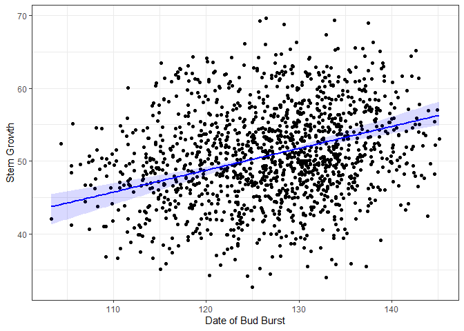
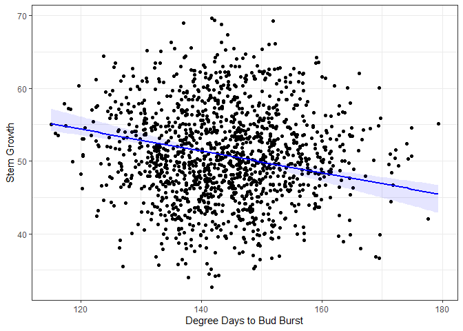

<!-- README.md is generated from README.Rmd. Please edit that file -->

# semEff

<!-- badges: start -->
<!-- [](https://travis-ci.com/murphymv/semEff) -->

[](https://github.com/murphymv/semEff/actions)

<!-- badges: end -->

`semEff` provides functionality to automatically calculate direct,
indirect, and total effects for ‘piecewise’ structural equation models,
comprising lists of fitted models representing structured equations
(Shipley 2000, 2009; Lefcheck 2016). Confidence intervals are provided
via bootstrapping.

Currently supported model classes are `"lm"`, `"glm"`, `"lmerMod"`,
`"glmerMod"`, `"lmerModLmerTest"`, `"gls"`, and `"betareg"`.

## Installation

You can install the released version of `semEff` from
[CRAN](https://CRAN.R-project.org) with:

``` r
install.packages("semEff")
```

And the development version from [GitHub](https://github.com/) with:

``` r
devtools::install_github("murphymv/semEff@dev")
```

## Example

``` r
# install.packages(c("semEff", "ggplot2"))
library(semEff)
library(ggplot2)

# Simulated data from Shipley (2009) on tree growth and survival (see ?Shipley)
head(Shipley)
#>   site tree      lat year     Date       DD   Growth  Survival Live
#> 1    1    1 40.38063 1970 115.4956 160.5703 61.36852 0.9996238    1
#> 2    1    2 40.38063 1970 118.4959 158.9896 43.77182 0.8433521    1
#> 3    1    3 40.38063 1970 115.8836 159.9262 44.74663 0.9441110    1
#> 4    1    4 40.38063 1970 110.9889 161.1282 48.20004 0.9568525    1
#> 5    1    5 40.38063 1970 120.9946 157.3778 50.02237 0.9759584    1
#> 6    1    1 40.38063 1972 114.2315 160.6120 56.29615 0.9983398    1

# Hypothesised SEM: latitude -> degree days to bud burst -> date of burst -> growth -> survival
lapply(Shipley.SEM, formula)
#> $DD
#> DD ~ lat + (1 | site) + (1 | tree)
#> 
#> $Date
#> Date ~ DD + (1 | site) + (1 | tree)
#> 
#> $Growth
#> Growth ~ Date + (1 | site) + (1 | tree)
#> 
#> $Live
#> Live ~ Growth + (1 | site) + (1 | tree)

# Bootstrap model effects (10,000 reps... can take a while)
# system.time(
#   Shipley.SEM.Boot <- bootEff(Shipley.SEM, R = 10000, seed = 53908, ran.eff = "site")
# )

# Calculate SEM effects (use saved bootstrapped SEM)
eff <- semEff(Shipley.SEM.Boot)

# Effects and CIs for response "Growth"
summary(eff, "Growth")
#> 
#> SEM direct, summed indirect, total, and mediator effects:
#> Growth (3/4):
#>            Variable Effect   Bias Std. Error Lower CI Upper CI  
#>            ________ ______ ______ __________ ________ ________  
#>                                                                 
#>  DIRECT    Date      0.382  0.011      0.058    0.289    0.513 *
#>                                                                 
#>  INDIRECT  lat       0.165  0.000      0.048    0.088    0.290 *
#>            DD       -0.240 -0.006      0.042   -0.351   -0.180 *
#>                                                                 
#>  TOTAL     lat       0.165  0.000      0.048    0.088    0.290 *
#>            DD       -0.240 -0.006      0.042   -0.351   -0.180 *
#>            Date      0.382  0.011      0.058    0.289    0.513 *
#>                                                                 
#>  MEDIATORS DD        0.165  0.000      0.048    0.088    0.290 *
#>            Date     -0.075 -0.006      0.016   -0.105   -0.048 *
#> 

# Extract total effects for Growth
tot <- totEff(eff, "Growth")
tot.b <- totEff(eff, "Growth", type = "boot")

# Predict effects for "Date" (direct) and "DD" (indirect) on Growth
mod <- Shipley.SEM$Growth
dat <- na.omit(Shipley)
fit <- sapply(c("Date", "DD"), function(i) {
  x <- seq(min(dat[i]), max(dat[i]), length = 100)
  x <- data.frame(x); names(x) <- i
  f <- predEff(mod, newdata = x, effects = tot[i], eff.boot = tot.b)
  c(x, f)
}, simplify = FALSE)

# Function to plot predictions
plotFit <- function(x, y, fit, x.lab = NULL, y.lab = NULL) {
  x2 <- fit[[1]]; f <- fit[[2]]; ci.l <- fit[[3]]; ci.u <- fit[[4]]
  ggplot () + 
    geom_point(aes(x, y)) +
    geom_ribbon(aes(x2, ymin = ci.l, ymax = ci.u, alpha = "0.15"), fill = "blue") +
    geom_line(aes(x2, f), color = "blue", size = 1) +
    xlab(x.lab) + 
    ylab(y.lab) +
    theme_bw() + 
    theme(legend.position = "none")
}

# Direct effects of Date
plotFit(x = dat$Date, y = dat$Growth, fit = fit$Date, x.lab = "Date of Bud Burst", y.lab = "Stem Growth")
#> Warning: Using alpha for a discrete variable is not advised.
```



``` r
# Indirect effects of DD (operating via Date)
plotFit(x = dat$DD, y = dat$Growth, fit = fit$DD, x.lab = "Degree Days to Bud Burst", y.lab = "Stem Growth")
#> Warning: Using alpha for a discrete variable is not advised.
```



``` r
# Huge amount of scatter around each fit as random effects explain most variation in stem growth! 
# Compare conditional vs. marginal R-squared:
r2 <- c(R2_cond = R2(mod)[[1]], R2_marg = R2(mod, re.form = NA)[[1]])
round(r2, 3)
#> R2_cond R2_marg 
#>   0.794   0.048
```

## References

Lefcheck, J. S. (2016). piecewiseSEM: Piecewise structural equation
modelling in R for ecology, evolution, and systematics. *Methods in
Ecology and Evolution*, **7**(5), 573–579. <https://doi.org/f8s8rb>

Shipley, B. (2000). A New Inferential Test for Path Models Based on
Directed Acyclic Graphs. *Structural Equation Modeling: A
Multidisciplinary Journal*, **7**(2), 206–218. <https://doi.org/cqm32d>

Shipley, B. (2009). Confirmatory path analysis in a generalized
multilevel context. *Ecology*, **90**(2), 363–368.
<https://doi.org/bqd43d>
